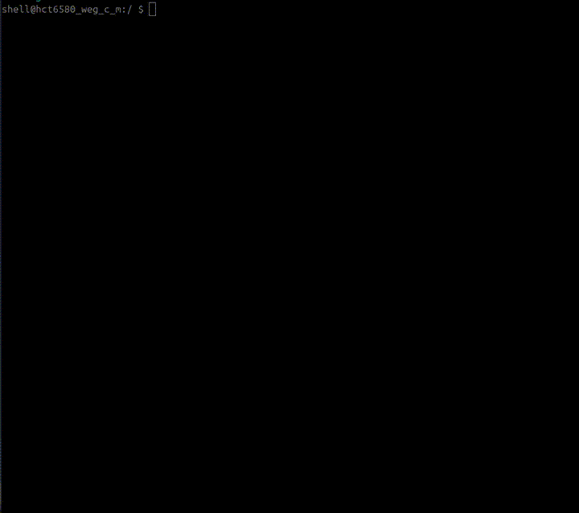

  

Exploits for a forever-day use-after-free in the Mali Utgard GPU kernel driver (so far only confirmed on ARM Mali-400 MP GPU in the MT6580). The bug it leverages was discovered on version *r6p2* of the driver, but it likely impacts later versions.

**Known vulnerable devices:**
- MT6580-based devices (T11 translator, Soyes XS11, Doogee X5)
- Kirin 620-based devices (Huawei P8 Lite)
- Any device with a Mali Utgard GPU that uses the ARM driver

**Known safe devices (tested):**
- Samsung devices with a Mali Utgard GPU (S3, S3 Mini, S5 Mini, Star, etc) - they don't appear to use the ARM driver
- Amazon Kindle Fire 7th Gen (MT8127) - they also appear to use code different from the ARM code

**Note:** To use these on other devices/kernels, compatiblity will need to be checked as the bug may be present but a lot of work might be needed to get root, this collection of exploits should be a good reference to work with.

## Blogs

[[0] Dumping Filesystem + Unlocking ADB Shell](https://luke-m.xyz/translator/p1.md)

[[1] Looking at Drivers, Rediscovering CVE-2022-34830](https://luke-m.xyz/translator/p2.md)

[[2] Finding Other Bugs in mali Driver](https://luke-m.xyz/translator/p3.md)

[[3] 2 Drivers, 1 Exploit](https://luke-m.xyz/translator/p4.md)

[[5] Should be an Easy Port, Right?](https://luke-m.xyz/translator/p6.md)

## Building/Running

Easiest with an Android NDK with pre-built toolchains, here is a `minnka` example for a 32-bit chipset (like the MT6580):
- `./android-ndk-r21e/toolchains/llvm/prebuilt/linux-x86_64/bin/armv7a-linux-androideabi24-clang minnka_t11_translator.c -o minnka -static`
- `adb push minnka /data/local/tmp`
- `adb shell /data/local/tmp/minnka`

And `frels` for a 64-bit chipset (like the Kirin 620):
- `android-ndk-r21e-linux-x86_64/android-ndk-r21e/toolchains/llvm/prebuilt/linux-x86_64/bin/aarch64-linux-android24-clang frels_huawei_p8_lite.c -o frels -static`
- `adb push frels /data/local/tmp`
- `adb shell /data/local/tmp/frels`

## Minnka - T11 Translator

This is an exploit I wrote for the T11 translator, it works by attacking the `sg_table` pointer in an `ion_buffer` that gets allocated in place of the free'd `mali_alloc` object. This lets you map arbitrary physical memory to userland and escalate privileges to root.

### Device Specifics According to Settings

| Property | Value |
| - | - |
| Model number | T11/T16 |
| Chipset | MT6580 |
| GPU | ARM Mali-400 MP |
| Android version | 7.0 |
| Kernel version | 3.18.35 |
| Build number | `K8321_V1.0.0_20240509` |
| SELinux | No |

### Example Run

## Frels - Soyes XS11

This is an exploit I wrote for the Soyes XS11, the `ion_buffer` method didn't work, so I used the UAF to free the same `mali_alloc` memory twice (and then holding it to prevent a double free), the second time with a completely controlled fake `mali_alloc` letting me get a write in the kernel and escalate privileges to root.

### Device Specifics According to Settings

| Property | Value |
| - | - |
| Model number | XS11 |
| Chipset | MT6580 |
| GPU | ARM Mali-400 MP |
| Android version | 6.0 |
| Kernel version | 3.18.19 |
| Build number | `A28C_T8_welcome-EN-G_V2_GSL2038_2_20230711` |
| SELinux | No |

### Example Run

## Frels - Doogee X5

- *v1*: Very similar exploit to the XS11, but using `setxattr` for spraying fake `mali_alloc` objects. This device also has SELinux, but that is easily bypassed by setting the `enforcing` global in the JOP-chain. Quite unreliable and usually dies when you interact with the phone (if it even gets to root).
- *v2*: Basically identical exploit to the Huawei P8 Lite, using `add_key` for the spray and fixing the freelist in the JOP-chain, much better reliability than v1.

### Device Specifics According to Settings

| Property | Value |
| - | - |
| Model number | X5 |
| Chipset | MT6580 |
| GPU | ARM Mali-400 MP |
| Android version | 6.0 |
| Kernel version | 3.18.19 |
| Build number | `DOOGEE-X5-Android6.0-20170904` |
| SELinux | Yes |

### Example Run

#### v1

#### v2

## Frels - Huawei P8 Lite

This device runs a 64-bit Kirin 620 which also has the bug. This is basically the same exploit as the XS11, but using `add_key` for spraying fake `mali_alloc` objects, and fixing the freelist in the JOP-chain. This device has SELinux, but that is easily bypassed by setting the `enforcing` global in the JOP-chain.

### Device Specifics According to Settings

| Property | Value |
| - | - |
| Model number | ALE-L21 |
| Chipset | Kirin 620 |
| GPU | ARM Mali-450 MP4 |
| Android version | 6.0 |
| EMUI version | 4.0 |
| Kernel version | 3.10.86-g6a5da10 |
| Build number | `ALE-L21C432B560` |
| SELinux | Yes |

### Example Run

