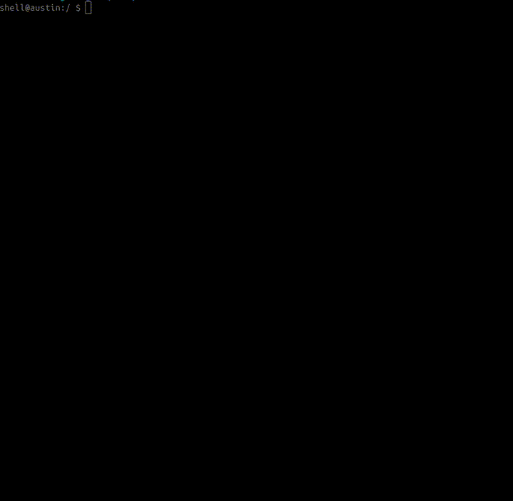

  

A collection of exploits for devices running Utgard GPUs - based on two forever-day bugs:
- A use-after-free on devices that use the open-source driver (*frels*/*minnka*)
- Arbitrary physical memory mapping to GPU (incl. kernel pages) + PP job for write (*kort*)

**Note:** To use these on other devices/kernels/builds, compatibility will need to be checked as the bug may be present but a lot of work might be needed to get root, this collection of exploits should be a good reference to work with.

### Confirmed Vulnerable

| Device | Chipset | Exploit |
|---------|---------|----------|
| T11 translator | MT6580 | minnka, kort |
| Soyes XS11 | MT6580 | frels, kort |
| Doogee X5 | MT6580 | frels, kort |
| Blackview A60 | MT6580 | frels |
| Huawei P8 Lite | Kirin 620 | frels |
| Huawei T3 7.0 | MT8127 | frels, kort |
| Amazon Kindle Fire 7 7th Gen (`austin`) | MT8127 | kort |
| Amazon Kindle Fire 7 5th Gen (`ford`) | MT8127 | kort |
| Sony Xperia E4 | MT6582 | kort |

### Probably Vulnerable

- Samsung devices with a Mali Utgard GPU (S3, S3 Mini, S5 Mini, Star, etc)
- Anything else with a Mali Utgard GPU

## Blogs

[[0] Dumping Filesystem + Unlocking ADB Shell](https://luke-m.xyz/translator/p1.md)

[[1] Looking at Drivers, Finding Bugs](https://luke-m.xyz/translator/p2.md)

[[2] Two Drivers, One Exploit](https://luke-m.xyz/translator/p3.md)

[[3] There is Always a Better Way](https://luke-m.xyz/translator/p4.md)

[[4] Should be an Easy Port, Right?](https://luke-m.xyz/translator/p5.md)

[[5] Three More Exploits](https://luke-m.xyz/translator/p6.md)

## Building/Running

Easiest with an Android NDK with pre-built toolchains, here is a `minnka` example for a 32-bit chipset (like the MT6580 or MT8127):
- `./android-ndk-r21e/toolchains/llvm/prebuilt/linux-x86_64/bin/armv7a-linux-androideabi24-clang minnka_t11_translator.c -o minnka -static`
- `adb push minnka /data/local/tmp`
- `adb shell /data/local/tmp/minnka`

And `frels` for a 64-bit chipset (like the Kirin 620):
- `android-ndk-r21e-linux-x86_64/android-ndk-r21e/toolchains/llvm/prebuilt/linux-x86_64/bin/aarch64-linux-android24-clang frels_huawei_p8_lite.c -o frels -static`
- `adb push frels /data/local/tmp`
- `adb shell /data/local/tmp/frels`

## T11 Translator

### Device Specifics According to Settings

| Property | Value |
| - | - |
| Model number | T11/T16 |
| Chipset | MT6580 |
| GPU | ARM Mali-400 MP |
| Android version | 7.0 |
| Kernel version | 3.18.35 |
| Build number | `K8321_V1.0.0_20240509` |
| SELinux | No |

### Frels

This is an exploit I wrote for the T11 translator, it works by attacking the `sg_table` pointer in an `ion_buffer` that gets allocated in place of the free'd `mali_alloc` object. This lets you map arbitrary physical memory to userland and escalate privileges to root.

#### Example Run

### Kort

Initially discovered this issue on the older version of the driver (no minnka/frels), but realised the exact same issue is on the open source driver. You can just map physical memory containing kernel fop pointers to GPU, execute PP job to overwrite the pointers, then trigger execution from userland.

#### Example Run

## Soyes XS11

### Device Specifics According to Settings

| Property | Value |
| - | - |
| Model number | XS11 |
| Chipset | MT6580 |
| GPU | ARM Mali-400 MP |
| Android version | 6.0 |
| Kernel version | 3.18.19 |
| Build number | `A28C_T8_welcome-EN-G_V2_GSL2038_2_20230711` |
| SELinux | No |

### Frels

This is an exploit I wrote for the Soyes XS11, the `ion_buffer` method didn't work, so I used the UAF to free the same `mali_alloc` memory twice (and then holding it to prevent a double free), the second time with a completely controlled fake `mali_alloc` letting me get a write in the kernel and escalate privileges to root.

**Note:** : This one didn't need a JOP-chain, but I did one anyway.

#### Example Run

### Kort

Another nice and easy kort exploit (basically identical to the translator one), map physical memory containing kernel fop pointer to GPU, execute PP job to overwrite the pointer, then trigger execution from userland.

#### Example Run

## Huawei P8 Lite

### Device Specifics According to Settings

| Property | Value |
| - | - |
| Model number | ALE-L21 |
| Chipset | Kirin 620 |
| GPU | ARM Mali-450 MP4 |
| Android version | 6.0 |
| EMUI version | 4.0 |
| Kernel version | 3.10.86-g6a5da10 |
| Build number | `ALE-L21C432B560` |
| SELinux | Yes |

### Frels

This device runs a 64-bit Kirin 620 which also has the bug. This is basically the same exploit as the XS11, but using `add_key` for spraying fake `mali_alloc` objects, and fixing the freelist in the JOP-chain. This device has SELinux, but that is easily bypassed by setting the `enforcing` global in the JOP-chain.

#### Example Run

## Huawei T3 7.0

### Device Specifics According to Settings

| Property | Value |
| - | - |
| Model number | BG2-W09 |
| Chipset | MT8127 |
| GPU | ARM Mali-450 MP4 |
| Android version | 6.0 |
| EMUI version | 4.1 |
| Kernel version | 3.18.22+ |
| Build number | `BG2-W09C170B005` |
| SELinux | Yes |

### Frels

Unlike the P8 Lite, this is based on a Mediatek MT8127 chipset. The exploit is practically identical to the P8 Lite exploit, just with a rewritten JOP-chain.

**Note:** : This one didn't need a JOP-chain, but I did one anyway (definitely intentional and not because I assumed it would be like the P8 Lite and have PXN).

#### Example Run

### Kort

Another kort exploit, basically identical to all of the previous kort exploits with different addresses.

#### Example Run

## Doogee X5

### Device Specifics According to Settings

| Property | Value |
| - | - |
| Model number | X5 |
| Chipset | MT6580 |
| GPU | ARM Mali-400 MP |
| Android version | 6.0 |
| Kernel version | 3.18.19 |
| Build number | `DOOGEE-X5-Android6.0-20170904` |
| SELinux | Yes |

### Frels

Basically identical exploit to the Huawei P8 Lite, using `add_key` for the spray and fixing the freelist in the JOP-chain, decent reliability.

#### Example Run

### Kort

Identical to the previous kort exploits, except using a JOP-chain this time (this one actually has some sort of PXN).

#### Example Run

## Blackview A60

### Device Specifics According to Settings

| Property | Value |
| - | - |
| Model number | A60 |
| Chipset | MT6580 |
| GPU | ARM Mali-400 MP |
| Android version | GO (8.1.0) |
| Kernel version | 3.18.79+ |
| Build number | `A60_W168_EEA_V1.0_20201123V23` |
| SELinux | Yes |

### Frels

This is one of the more 'modern' MT6580-based devices, I wanted to see if it was easy enough to port these exploits to a later Android version (in this case, 8.1.0). Annoyingly, a decent amount has changed, kernel code is no longer writeable by the kernel (so no longer trivial to overwrite fop pointers in drivers), and userland memory is no longer accessible from kernel (or executable of course, but we already encountered that). 

There is also an annoying change in the driver on this device, they seem to have patched some race condition by adding some extra checks/object tracking, which avoids a UAF, but luckily it is super easy to work around - you just have to do an extra allocation to render their check ineffective and hit this bug.

Despite this, I ended up needing another bug as the existing 'patch function pointer in fop table' no longer works as kernel code isn't writeable. Luckily I had a Mediatek bug in my back pocket which lets me leak data from the kernel. This let me leak `/proc/driver/wmt_aee`'s `proc_dir_entry` address, letting me locate the fop handlers and therefore the address of the `open` handler, this gives me code execution. To get memory in a known place for the JOP-chain, I just allocated an ion buffer of about 500mb and filled it with the JOP-chain, due to lack of kASLR, I was able to just 'guess' a pointer that might have the controlled data in it, and most of the time it does!

This exploit is kinda reliable, you need both the ion spray to work, and the UAF to land - but it can be leveraged to get root! However, when it comes to MT6580, I think this is as 'modern' as it gets.

#### Example Run

## Kindle Fire 7 (7th Gen)

### Device Specifics According to Settings

| Property | Value |
| - | - |
| Model | austin |
| Chipset | MT8127 |
| GPU | ARM Mali-450 MP4 |
| Android version | 5.1.1 |
| Fire OS version | 5.7.1.0 |
| Kernel version | 3.10.54+ |
| Build number | `659664620` |
| SELinux | Yes |

### Kort

This device uses the driver that is very different to the open source driver. However, this driver has a nice bug that lets you map arbitrary physical pages into the GPU, including ones that contain kernel memory. This means we can map a known kernel page into the GPU, create a write-back PP job that will write the same value lots of times over a region, and use this as our write primitive to clobber a function pointer. This device doesn't have PXN either, so its a simple *ret2usr* to get root on this one.

**Note**: I did have to root this one to debug the exploit, why block **/proc/last_kmsg** `</3`

#### Example Run

## Kindle Fire 7 (5th Gen)

### Device Specifics According to Settings

| Property | Value |
| - | - |
| Model | ford |
| Chipset | MT8127 |
| GPU | ARM Mali-450 MP4 |
| Android version | 5.1.1 |
| Fire OS version | 5.3.6.4 |
| Kernel version | 3.10.54+ |
| Build number | `626533320` |
| SELinux | Yes |

### Kort

Very similar to the 7th gen exploit, just using `wmt_dbg` as the trigger instead of `wmt_aee` (think it was overwriting `open` but no root = no debug on this thing).

**Note**: Didn't have to root this one, it just worked!

#### Example Run

## Sony Xperia E4

### Device Specifics According to Settings

| Property | Value |
| - | - |
| Model | E2105 |
| Chipset | MT6582 |
| GPU | ARM Mali-400 MP |
| Android version | 4.4.4 |
| Kernel version | 3.4.67 |
| Build number | `24.0.A.5.14` |
| SELinux | Yes |

### Kort

Practically identical to the Kindle Fire 7 exploit, except this uses `wmt_dbg` `write()` instead of `wmt_aee` `read()` for the code execution trigger.

#### Example Run

